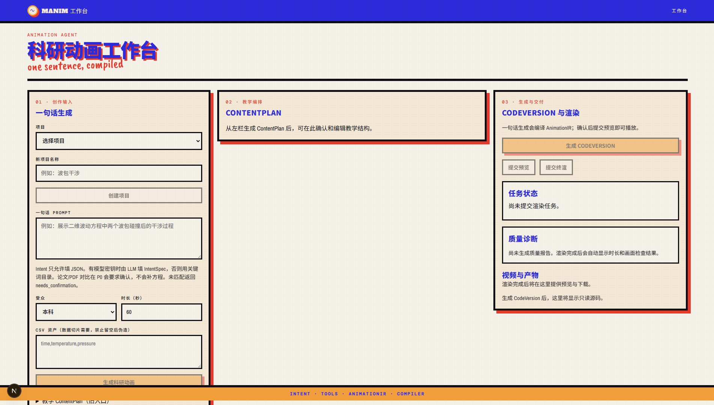

# Manim 数学动画工作台

本地 AI 数学动画工作台，面向教师、数学内容创作者，以及需要把一句科学描述变成可审阅短片的研究者。

仓库里有两条生成路径，不要混成一条“万能 Agent”：

    教学 Prompt → ContentPlan → CodeVersion → Preview/Final 视频 → 质量诊断
    一句话科研 Prompt → IntentSpec → 白名单 Tools → AnimationIR 2.0 → 确定性 Compiler → 同一套 Docker Preview

教学路径仍可能让模型写受 AST allowlist 约束的 Manim Scene。科研路径（Animation Agent V2）禁止模型写自由 Scene Python；数字来自 ToolRun 产物，编译器 lowering 预计算数组。

当前一句话入口：有 `DEEPSEEK_API_KEY` 时 LLM 只填 `IntentSpec` JSON；否则回退关键词目录。匹配或推断到六个可编译切片才会出片；论文 PDF 切片在 P0 没有解析器，返回 `needs_confirmation`。未匹配返回 `needs_confirmation`。CSV 没有正文时返回 `asset_required`，拒绝伪造数据。P0 范围以 `docs/research/animation-agent-v2.md` 为准。

## 当前能力

- 本地工作台自动建立会话（Cookie + CSRF 仍在）；不使用登录页
- 项目、Prompt、ContentPlan、CodeVersion 的不可变版本链
- 教学路径：公式推导、函数可视化、平面几何、几何证明、三维、混合
- 科研路径：六个 P0 切片（波包干涉、Fourier/Gibbs、Lorenz、PID、CSV 异常、Frenet）
- Scene IR 1.6 教学 gallery 与 AnimationIR 2.0 科研 compiler 共用 ManimCE 0.21 渲染沙箱
- Preview 和 Final 渲染任务、Redis 队列、Runner 恢复和取消
- 视频、缩略图、渲染日志等产物交付
- 目标时长、估算时长、实际时长以及确定性画面质量诊断
- Phase 9 验收数据和证据位于 benchmarks/phase9/

当前项目定位是本地开发和验收环境，不是生产部署方案。真实用户市场验证仍属于后续工作。产品路径不使用登录页；打开工作台会自动签发本地会话。`POST /auth/login` 仍保留给 Phase 8 测试。若要强制走登录，设置 `MANIM_WORKBENCH_AUTH_DISABLED=false`。

## 演示

### 工作台界面

三栏工作台分别承载创作输入、ContentPlan 教学编排以及 CodeVersion 与渲染交付：

### 生成视频

下面是一个公式推导 Final 渲染示例。也可以直接下载 [MP4 视频](docs/assets/formula-derivation-demo.mp4)。

<video controls width="720" poster="docs/assets/formula-derivation-demo.jpg">
  <source src="docs/assets/formula-derivation-demo.mp4" type="video/mp4" />
  当前 Markdown 渲染器不支持内嵌视频，请打开上面的 MP4 链接。
</video>

## 架构

    浏览器
      │ HTTP + Cookie/SSE
      ▼
    Next.js Web :3000
      │ same-origin /api rewrite → FastAPI :8000
      ▼
    FastAPI API :8000 ── SQLite
      │                     │
      ├── 教学：LLM ContentPlan / CodeVersion
      ├── 科研：Intent → Tools → AnimationIR → Compiler
      └── Redis 队列 ◄──────┘
              ▲
              │
        Python Runner
              │
        Compute Sandbox（白名单工具） / Render Sandbox（禁网 Docker）

主要目录：

| 目录 | 用途 |
| --- | --- |
| apps/api | FastAPI API、鉴权、业务服务和质量报告 |
| apps/runner | Redis 队列协调、租约、隔离渲染和产物处理 |
| apps/web | Next.js 工作台界面 |
| packages/contracts | Python/TypeScript 共享契约和生成输出 |
| migrations/versions | Alembic 数据库迁移 |
| reference_scenes | Manim 参考场景 |
| tests/phase*、tests/agent、tests/ir、tests/web | 分阶段、Agent、IR 与 Web 测试 |
| benchmarks、eval | 验收数据、黄金集和证据 |

## 新电脑复现要求

推荐环境：

- Windows 10/11
- WSL2，Ubuntu 或兼容发行版
- Python 3.10
- Node.js 22 或更高版本
- Docker Desktop，并开启 WSL2 Integration
- Git、curl、openssl
- uv Python 包管理器

仓库应放在 WSL 原生文件系统，例如 /home/<user>/projects/Manim_project。不要从 /mnt/c 或 /mnt/i 运行 Node 安装与构建。

## 从零安装

以下命令在 WSL 终端执行。

### 1. 获取代码

    mkdir -p ~/projects
    cd ~/projects
    git clone https://github.com/<owner>/Manim_project.git
    cd Manim_project

如果新电脑尚未配置 GitHub SSH，也可以先用 HTTPS 克隆，再配置 SSH。后续推送使用仓库的 origin 远端。

### 2. 安装锁定依赖

    uv sync --frozen
    npm ci --ignore-scripts

### 3. 创建本地环境文件

    cp .env.example .env
    openssl rand -hex 32

编辑 .env，填写 DeepSeek 密钥和刚刚生成的内部令牌：

    DEEPSEEK_API_KEY=your_deepseek_api_key
    MANIM_WORKBENCH_INTERNAL_TOKEN=将openssl生成的64位十六进制字符串填入这里
    MANIM_WORKBENCH_DATABASE_URL=sqlite:///./data/manim_workbench.db
    MANIM_WORKBENCH_REDIS_URL=redis://127.0.0.1:6379/0
    MANIM_WORKBENCH_API_URL=http://127.0.0.1:8000
    MANIM_WORKBENCH_RUNNER_ID=runner-local-01
    MANIM_WORKBENCH_RUNNER_ROOT=runtime/phase5
    MANIM_WORKBENCH_ARTIFACT_ROOT=runtime/phase5/artifacts
    MANIM_WORKBENCH_COOKIE_SECURE=false
    MANIM_WORKBENCH_SESSION_MAX_AGE_SECONDS=28800

本地 Web 不要设置 NEXT_PUBLIC_API_URL，让浏览器走同源 /api；Next 会把 /api 反代到 MANIM_WORKBENCH_API_URL。工作台默认不登录：`GET /auth/session` 会为 `dev@local.test` 自动建会话。

Runner 到 API 的内部调用必须保持本机地址；Runner 会拒绝外部网卡地址。不要把真实密钥、密码、.env、data/ 或 runtime/ 提交到 Git。

### 4. 处理 Windows 到 WSL 的访问地址

如果浏览器在 Windows 侧，且 localhost 无法转发到 WSL，请使用 WSL IP：

    WSL_IP="$(hostname -I | awk '{print $1}')"
    echo "$WSL_IP"

将下面的 <WSL_IP> 替换为上一步输出的实际 IP，浏览器访问地址为：

    http://<WSL_IP>:3000/login

把这个 IP 加入 .env 的 CORS 来源：

    MANIM_WORKBENCH_ALLOWED_ORIGINS=http://localhost:3000,http://127.0.0.1:3000,http://<WSL_IP>:3000
    NEXT_ALLOWED_DEV_ORIGINS=localhost,127.0.0.1,<WSL_IP>

每次 WSL 重启后 IP 可能变化；IP 变化时更新来源，并在启动 Web 时使用新 IP。API 仍监听 0.0.0.0:8000，Runner 的内部 API 地址仍使用 127.0.0.1:8000。

### 5. 初始化 Redis 和数据库

    docker compose -f infra/compose.yaml up -d redis
    uv run --env-file .env alembic upgrade head

检查 Redis：

    docker compose -f infra/compose.yaml ps

### 6. 账号（可选）

本地工作台不需要 `create_user`。打开 `/workbench` 即可。只有把 `MANIM_WORKBENCH_AUTH_DISABLED=false` 时才需要：

    uv run --env-file .env python scripts/create_user.py your@email.com

## 启动服务

建议打开三个 WSL 终端，并都进入仓库目录：

    cd /home/<user>/projects/Manim_project

### 终端 1：API

    uv run --env-file .env uvicorn manim_workbench_api.main:app --host 0.0.0.0 --port 8000

### 终端 2：Runner

    uv run --env-file .env python -m manim_workbench_runner run

看到 runner_outcome 为 idle 表示 Runner 正在等待任务；recovery_complete 表示启动恢复检查已完成。

### 终端 3：Web

不要设置 NEXT_PUBLIC_API_URL。浏览器应请求 Web 同源的 /api，由 next.config.ts rewrite 到本机 API，否则会话 Cookie 会跨源丢失。

如果浏览器通过 WSL IP 访问，把 <WSL_IP> 替换为实际值：

    cd /home/<user>/projects/Manim_project/apps/web
    NEXT_ALLOWED_DEV_ORIGINS=<WSL_IP> ../../node_modules/.bin/next dev --hostname 0.0.0.0

如果 Windows 到 WSL 的 localhost 转发正常：

    cd /home/<user>/projects/Manim_project/apps/web
    ../../node_modules/.bin/next dev --hostname 0.0.0.0

### 持久运行（可选）

如果不希望服务随当前终端关闭，可以使用 tmux：

    tmux new-session -d -s manim-api 'cd /home/<user>/projects/Manim_project && uv run --env-file .env uvicorn manim_workbench_api.main:app --host 0.0.0.0 --port 8000'
    tmux new-session -d -s manim-runner 'cd /home/<user>/projects/Manim_project && uv run --env-file .env python -m manim_workbench_runner run'
    tmux new-session -d -s manim-web 'cd /home/<user>/projects/Manim_project/apps/web && NEXT_ALLOWED_DEV_ORIGINS=<WSL_IP> ../../node_modules/.bin/next dev --hostname 0.0.0.0'

查看和停止会话：

    tmux ls
    tmux attach -t manim-api
    tmux kill-session -t manim-api

## 访问和验证

使用实际地址替换 <WSL_IP>：

| 用途 | 地址 |
| --- | --- |
| 工作台 | http://<WSL_IP>:3000/workbench |
| API 文档 | http://<WSL_IP>:8000/docs |
| API 健康检查 | http://<WSL_IP>:8000/api/v1/health |

命令行验证：

    curl -fsS http://<WSL_IP>:8000/api/v1/health
    curl -fsS -o /dev/null -w 'web=%{http_code}\n' http://<WSL_IP>:3000/workbench

健康检查应返回：

    {"status":"ok","service":"api","contract_schema_version":"1.7"}

API 根路径 / 没有业务页面，返回 {"detail":"Not Found"} 是正常的；浏览器 UI 应访问 Web 的 :3000/workbench。`/login` 会跳转到工作台。

## 使用指南：一句话科研动画

1. 打开工作台，无需登录。
2. 创建项目，例如“波包干涉”。
3. 在“一句话 Prompt”填写科学描述，必要时粘贴 CSV，点击「生成科研动画」。
4. 审阅「自动推断」卡片里的 domain 与 assumptions。未匹配关键词时系统会要求确认，不会出片。
5. 匹配成功后，系统走 ToolRun → AnimationIR → Compiler，再提交现有 Preview。
6. 在「生成与交付」观看 Preview。教学 ContentPlan 入口仍在折叠面板里，不要和科研路径混用口径。

P0 可用 Prompt 示例：

    展示二维波动方程中两个波包碰撞后的干涉过程

关键词目录当前匹配：波包/干涉、傅里叶/Gibbs/方波、Lorenz/洛伦兹、PID/阶跃响应、CSV/temperature/异常、Frenet/切向量/螺旋。

## 使用指南：教学 Prompt 到视频

1. 打开工作台，无需登录。
2. 创建项目，例如“二次函数顶点公式推导”。
3. 展开“教学 ContentPlan（旧入口）”，填写教学 Prompt、受众、时长、推导风格和明确假设。
4. 提交 Prompt，生成 ContentPlan。
5. 检查教学目标、公式步骤、视觉意图和旁白占位；必要时编辑并保存 ContentPlan 新版本。
6. 在“生成与交付”点击“生成 CodeVersion”。生成的 Python 代码只读展示，不能在浏览器中直接修改执行。
7. 点击“提交预览”创建 Preview 渲染任务，Runner 会从 Redis 队列领取任务。
8. 观察任务状态、预览视频、缩略图和渲染日志；确认内容后可提交 Final 渲染。
9. 在质量报告区域查看时长、静止画面、乱码、越界、关键对象缺失等诊断结果。

教学路径首次验证可使用这个 Prompt：

    讲解如何从一般式 y=ax^2+bx+c 推导二次函数的顶点坐标公式。
    通过配方法逐步变形，说明顶点横坐标为什么是 -b/(2a)，并使用 y=2x^2-4x+1 验证结果。

明确假设：

    a ≠ 0
    a、b、c 为实数
    使用配方法进行推导
    最后使用 y=2x^2-4x+1 验证结果

## 常见问题

### 页面能打开，但点击按钮没有反应

确认浏览器使用的是当前 WSL IP，而不是失效的 Windows localhost 转发，例如：

    http://<WSL_IP>:3000/workbench

开发服务器通过 NEXT_ALLOWED_DEV_ORIGINS 接收对应 IP；如果 IP 发生变化，更新启动命令或本地 .env 并重启 Web。

### API 返回 Not Found

这是因为访问了 API 根路径。使用 /docs 或 /api/v1/health；工作台页面在 Web 的 :3000 端口。

### 打开工作台提示无法恢复会话

确认浏览器访问的是 Web 端口，且未设置 NEXT_PUBLIC_API_URL，这样 `/api` 与页面同源。默认会自动签发本地会话，不需要 create_user。

若仍失败，看 API 是否在 :8000 运行，以及 MANIM_WORKBENCH_ALLOWED_ORIGINS 是否包含当前 Web origin。

### Runner 报 Phase 5 API must use a private/local HTTP endpoint

这是预期安全保护。MANIM_WORKBENCH_API_URL 必须是：

    MANIM_WORKBENCH_API_URL=http://127.0.0.1:8000

浏览器不要把 NEXT_PUBLIC_API_URL 指到 API 的 WSL IP；应走 Web 同源 /api rewrite。

### 预览提交失败

按顺序确认：

1. ContentPlan 已生成并确认；
2. CodeVersion 已生成；
3. Runner 输出 runner_outcome；
4. API 健康检查返回 200；
5. 浏览器地址和 MANIM_WORKBENCH_ALLOWED_ORIGINS 使用同一个 Web origin；未设置 NEXT_PUBLIC_API_URL。

查看 API 和 Runner 终端的第一条错误信息，不要只看前端的通用提示。

## 开发命令

安装和生成：

    uv sync --frozen
    npm ci --ignore-scripts
    uv run python scripts/generate_contracts.py
    uv run python scripts/generate_contracts.py --check
    uv run --env-file .env alembic upgrade head

质量门禁：

    uv run ruff check .
    uv run pytest -s -q
    npm run lint
    npm run typecheck
    npm run build

阶段验收：

    uv run python scripts/phase8_acceptance.py
    uv run python scripts/phase9_acceptance.py
    uv run python scripts/phase9_real_render_acceptance.py --workers 1

## 文档索引

- 项目计划：docs/PROJECT_PLAN.md
- Phase 5 规格与威胁模型：docs/PHASE5_SPEC.md、docs/PHASE5_THREAT_MODEL.md
- Phase 8 规格与威胁模型：docs/PHASE8_SPEC.md、docs/PHASE8_THREAT_MODEL.md
- Phase 9 规格与威胁模型：docs/PHASE9_SPEC.md、docs/PHASE9_THREAT_MODEL.md
- Phase 9 状态：docs/PHASE9_STATUS.md
- 渲染引擎决策：docs/decisions/0001-select-manim-community.md
- ManimCE 0.21：docs/decisions/0002-upgrade-manim-community-0.21.md
- Animation Agent compiler/tools：docs/decisions/0003-animation-agent-compiler-tools.md
- Animation Agent 研究：docs/research/animation-agent-v2.md
- Phase 9 真实验收报告：benchmarks/phase9/real_acceptance_report.json

## Git 和贡献约定

- 提交使用 Conventional Commit 风格，例如 feat:、fix:、test:、docs:、chore:。
- 提交前运行相关 lint、typecheck、build 和测试。
- 不提交 .env、API 密钥、运行时数据库、视频、沙箱产物和本地日志。
- 保留其他开发者的未提交修改；推送或创建 PR 前先确认提交范围。
