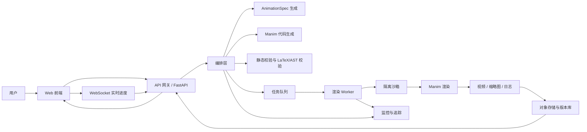

# 用 Manim 构建语言生成数学动画 WebApp 的分析报告

## 执行摘要

如果你的目标是做一个“通过语言描述生成数学动画”的 WebApp，**Manim 是非常合适的底层引擎，但不适合直接暴露为“任意 Python 代码生成器”**。更稳妥的产品路线是：把自然语言先转换成**受约束的动画规格 AnimationSpec**，再由模型把规格转成 Manim 代码，随后在**隔离沙箱**中渲染，并通过**渲染结果回环修复**来提高可用率。这样做的原因很直接：Manim 本身具备强大的数学排版、场景控制、分段输出、插件扩展和 Docker 部署能力，但近期研究也明确指出，**代码能跑不等于动画好看或教学有效**，很多问题只有渲染后才能发现，例如公式拥挤、遮挡、节奏不对和视觉层级混乱。citeturn0search4turn0search5turn3search2turn3search9turn17search17turn9search8turn9search12

从产品策略上看，**首个版本不应追求“万能”**，而应先面向三类高价值用户：教师与教辅团队、数学科普/课程创作者、以及希望把“文字/题目/定理”自动转成短视频或讲解卡片的教育产品团队。现有市场上已经出现了浏览器内的 prompt-to-Manim 工具和在线 playground，但多数产品要么偏“演示原型”，要么偏“后期编辑器”，真正同时兼顾**生成质量、可编辑性、版本管理、协作、企业安全和成本控制**的成熟方案仍然稀缺，这意味着你有机会通过“规范化生成 + 可视化编辑 + 渲染质量保障”做出差异化。citeturn16search2turn16search8turn16search11turn16search0turn16search7turn16search12turn8search6turn8search8

在技术实现上，我的明确建议是采用**前后端分离 + 后端任务队列 + 混合渲染策略**：前端负责文本/语音输入、规格确认、低清预览和版本管理；后端负责结构化解析、代码生成、静态检查、Manim 渲染、结果缓存和回调通知；默认走**离线渲染**以保证稳定性，同时提供**低质量快速预览**与**按 section 分段预览**来模拟“近实时”体验。模型层建议采用**双模型或三模型分工**：一个负责规划与规格化，一个负责代码生成/修复，一个负责安全或低成本分类任务。OpenAI、Anthropic 和 Meta 目前都提供了适合这类工作流的结构化输出、工具调用、多语言和代码能力，但在成本、可控性和部署方式上差异明显。citeturn1search0turn1search4turn11search0turn11search5turn23search15turn23search7turn22search3turn22search2turn4search1turn4search4turn17search1

商业化上，最可行的路线不是一上来做“大众免费生成器”，而是先做**带信用点数或配额的 Pro 工具**，并尽快补上**团队协作、品牌模板、项目空间、私有部署或 VPC 部署、API 接入**这些高毛利能力。由于渲染和模型调用都具有明显的变动成本，定价更适合采用“**订阅 + 渲染额度 + 高级协作/企业附加包**”的组合，而不是纯无限制订阅。citeturn21search8turn10search13turn20search16turn15search1turn15search3

## 产品定位与使用场景

**维度：目标用户与使用场景**

**问题清单。** 你需要先回答四个产品定位问题：第一，首发用户到底是“讲课的人”还是“学数学的人”；第二，用户要的是“成片视频”还是“可编辑工程”；第三，是强调“教学解释”还是“视觉炫技”；第四，是否要支持团队协作与品牌模板。这几个问题会直接决定你是做一个“AI 生成器”，还是做一个“数学动画创作平台”。从现有公开产品和论文来看，需求最强的场景集中在**定理解释、题目讲解、概念可视化、研究内容教学化、短视频科普、课程资产批量生产**。AnimG 强调从自然语言到 lesson-ready video，TheoremExplainAgent 面向定理解释视频，Pedagogy-Aware STEM 动画论文也明确把教师与教学场景作为目标。citeturn16search2turn16search8turn9search14turn9search6

| 目标用户 | 典型场景 | 优点 | 风险 |
|---|---|---|---|
| 教师与教辅团队 | 讲函数、几何、线代、概率；把教材内容转成短动画 | 需求稳定、愿意为节省备课时间付费 | 对准确性、可控性、中文支持要求高 |
| 内容创作者与课程制作者 | 制作 YouTube/B 站/课程平台数学动画 | 对精致视觉和品牌风格有强需求，ARPU 更高 | 更关注编辑能力，不满足于一次生成 |
| 教育产品与 AI Tutor 团队 | 把题目、定理、知识点自动变为解释短片/API | 可做 API/企业方案，扩展性好 | 对 SLA、安全、批量吞吐要求高 |
| 学生个人用户 | 输入题目或概念看解释动画 | 容易获客，传播性强 | 付费率低，成本回收难 |

上表并不是简单的市场直觉，而是能从现有生态中看到趋势：Manim 的官方定位本来就偏“解释性数学动画”；AnimG 的对外信息强调 lesson-ready 和 browser-based workflow；TheoremExplainAgent、Manimator、Pedagogy-Aware pipelines 则都围绕“把知识文本转成可解释视频”的场景展开。citeturn0search4turn16search2turn9search3turn9search6turn9search14

**可选方案比较。**  
如果你做**面向学生的即时生成工具**，增长可能更快，但你会立刻遇到内容安全、成本和准确率三重压力。  
如果你做**面向教师/创作者的生产工具**，获客慢一些，但产品路线更清晰，因为他们愿意为“可编辑性、项目管理、模板、品牌一致性”付费。  
如果你做**B2B API**，长期价值最大，但前提是你已经证明自动生成质量稳定，并能提供企业级运维与安全能力。citeturn16search0turn16search7turn16search12turn12search3turn12search10

**推荐方案与理由。**  
我建议你把首发定位为：**“面向教师/数学内容创作者的 AI 数学动画工作台”**，而不是“面向学生的免费自动解题动画器”。原因是：Manim 天生偏创作型工作流；现有浏览器产品已经验证了自然语言生成的吸引力，但真正稀缺的是“生成之后还能专业地改、审、导出、复用”；同时，教育/创作者人群也更接受“先生成草稿，再精修”的交互模式。这个定位还能自然衍生到第二阶段的团队版和 API 版。citeturn18search18turn16search2turn16search11turn8search6turn9search6

**实施步骤与里程碑估算。**  
如果预算和团队规模未指定，我会按以下顺序推进：  
第一阶段，用 2 到 3 周完成用户访谈和语料收集，重点收“函数图像、几何证明、公式推导、线代变换”四大类 prompt。  
第二阶段，用 4 到 6 周做出可演示 MVP：文本输入、规格确认、快速预览、最终渲染、项目保存。  
第三阶段，再用 4 到 6 周补可视化编辑器、版本管理和模板系统。  
粗略人力上，MVP 至少需要 **1 名前端、1 名后端/基础设施、1 名 LLM/算法工程师**，若希望体验更完整，再加 **0.5 到 1 名产品设计** 更稳妥。这个估算是基于 Manim 渲染链路、任务队列、模型编排与前端交互复杂度的综合判断。

## 功能设计与交互体验

**维度：功能清单**

你最需要避免的一件事，是在 V1 就把“高级代码编辑器、多人协作、语音旁白、模板商店、素材库、API、品牌化输出”全部塞进去。更合理的做法是把功能分成**核心功能、可选功能、高级功能**三层，并且让每一层都直接服务于“从文字到动画”的主链路。Manim 本身已经提供了 Scene、Tex/MathTex、TransformMatchingTex、分段 section、输出设置、缓存、插件和 voiceover 等能力，这意味着你不需要从零发明动画引擎，真正要解决的是**生成控制与产品包装**。citeturn18search18turn7search0turn7search4turn17search2turn17search18turn17search17turn18search5turn18search2

| 功能层级 | 建议功能 | 为什么重要 |
|---|---|---|
| 核心功能 | 文本输入、动画规格确认、Manim 代码生成、快速预览、最终渲染、项目保存、导出 MP4/GIF、错误提示 | 这是最小可用闭环 |
| 可选功能 | 语音输入、LaTeX 公式编辑、按 section 预览、模板与风格预设、版本历史、提示词改写建议 | 会显著提高可控性与复用率 |
| 高级功能 | 可视化时间轴编辑器、多人协作、品牌模板、API/SDK、旁白生成、自动字幕、素材资产管理、私有部署 | 这些能力决定商业化上限 |

这个分层也与生态现状一致：AnimG 已经证明“prompt + 浏览器渲染 + playground”是有吸引力的；Manim Editor 则证明了**后处理/展示/项目式组织**有价值；Manim Motion 进一步说明“浏览器中的可视化编辑器”是下一步天然演化方向。citeturn16search2turn16search11turn16search0turn16search7turn16search12

**可选方案比较。**  
方案 A 是**纯 prompt 驱动**：用户写一句话，系统直接生成视频。优点是极简，缺点是不可控，返工率高。  
方案 B 是**prompt + 规格确认**：系统先生成 storyboard / AnimationSpec，用户勾选后再渲染。优点是能处理歧义、降低返工；缺点是多一步交互。  
方案 C 是**prompt + 规格 + 可视化编辑器**：这是最强方案，但前期开发成本和复杂度明显更高。基于最近的研究与现有产品表现，我认为 B 是最好的 V1 形态，而 C 应作为 V2。citeturn1search0turn23search15turn9search3turn9search12turn16search8

**推荐方案与理由。**  
推荐从一开始就引入一个**中间规格层**，名字可以叫 `AnimationSpec` 或 `ScenePlan`。这个结构至少要包含：主题、教学目标、时长、场景列表、每个场景的对象、动画动作、公式列表、镜头节奏、旁白占位和风格预设。这样做有三个好处：  
其一，你可以用 Structured Outputs 把模型强约束到 JSON Schema 上；  
其二，前端可以直接把规格可视化展示出来；  
其三，后端可以围绕规格做校验、缓存和 diff。OpenAI 和 Anthropic 都已提供面向结构化 JSON 的官方能力。citeturn1search0turn1search16turn23search15turn23search13

**实施步骤与里程碑估算。**  
功能层面我建议分三批做：  
第一批 3 到 4 周，完成 prompt 输入、规格面板、预览渲染、导出。  
第二批 2 到 4 周，加入模板、版本历史、LaTeX 编辑和 section 预览。  
第三批 4 到 8 周，再做时间轴编辑器、旁白、团队协作和 API。  
人力上，第一批以 1 前端 + 1 后端 + 1 LLM 工程师可推进；第二批开始最好补 1 设计/产品与 0.5 测试支持。

**维度：交互设计与 UX**

在 UX 上，最容易失败的地方不是“模型不够聪明”，而是用户搞不清楚系统**到底理解了什么**。所以我建议界面采用**三栏结构**：左侧输入，中间是“系统理解后的动画规格”，右侧是预览与版本历史。这样用户不是对着黑盒等待，而是在一个可以修改假设、查看数学表达式、回滚历史版本的工作台里创作。类似的项目式与展示式思路，已经在 Manim Editor 的 presenter/project 设计里被验证过。citeturn16search0turn16search7turn16search15

就输入方式来说，**文本输入必须是主入口，语音输入应作为增强能力**。OpenAI 官方文档已经把文件转写、实时转写、音频与实时语音交互都做成了独立能力路径；如果你想要中文口述“帮我把勾股定理做成一步步证明动画”，那么实时转写会比自己拼本地 ASR 链路更省工程时间。若你未来想支持“边说边改”，OpenAI 的实时语音模型也支持多语输入与转写。citeturn1search1turn1search5turn1search9turn1search13turn22search22

数学公式输入与即时预览方面，我建议采用**KaTeX 做默认预览，MathJax 做无障碍增强或复杂回退**。KaTeX 官方强调其渲染速度快、可同步渲染且支持服务端预渲染；MathJax 则在辅助技术、屏幕阅读器和表达式探索方面更强。对一个 WebApp 来说，这意味着：普通场景优先 KaTeX，若用户开启“可访问性模式”或遇到复杂宏包兼容问题，再切到 MathJax 更合理。citeturn7search2turn7search6turn7search3turn7search11

版本控制上，不必一开始就做完整 Git 体验，但至少要有**“生成版本”“用户修改版本”“渲染产物版本”**三层记录。Manim 的 section 与 segmented output 非常适合做“按段预览”和“按段回滚”；官方文档也支持 `--save_sections` 和 Segmented Video API。citeturn17search1turn17search9turn24search7

**推荐方案与理由。**  
我建议首屏交互做成：  
“文本输入框 + 风格预设 + 时长档位 + 数学难度/受众选择 + 规格面板 + 低清预览”。  
语音输入、时间轴编辑器和高级视觉编辑，放到第二阶段。  
这样你既能保留“自然语言生成”的魔法感，又能通过规格面板把不确定性显式化，显著减少误解和返工。citeturn16search8turn7search2turn7search3turn17search1

**实施步骤与里程碑估算。**  
第 1 个迭代先把文本输入、规格确认、单版本预览做顺；第 2 个迭代引入公式即时预览与版本历史；第 3 个迭代再加语音输入、可视化时间轴和多人评论。粗略需要 6 到 10 周，2 名前端工程师的效率会明显高于 1 人单打独斗。

## 系统架构与 API 设计

**维度：系统架构设计**

Manim 的核心工作流是：以 `Scene` 为画布，在 `construct()` 中管理 mobjects 和 animations，最终由 `SceneFileWriter` 写入视频文件并通过 FFmpeg 输出。官方也明确说明渲染过程会经历准备、render loop、生成 partial movie files、最终合并等步骤；渲染器则可在 Cairo 与 OpenGL 间切换。对 WebApp 来说，这意味着你完全可以把 Manim 当成一个**可编排的渲染内核**，但不应该把它直接塞进同步 HTTP 请求里。citeturn3search7turn3search9turn24search4turn0search5turn0search8

我建议的整体架构如下：

这个架构和现成生态是吻合的：FastAPI 原生支持高性能 API 与 WebSocket；Celery 是成熟的分布式任务队列；Manim 官方维护 Docker 镜像；Kubernetes 和 Argo Rollouts 则适合作为后续扩缩容与灰度发布基础设施。citeturn4search12turn4search4turn4search1turn3search2turn4search23turn12search3

| 架构方案 | 描述 | 优点 | 缺点 | 建议 |
|---|---|---|---|---|
| 单体同步渲染 | 前端请求直接触发渲染并等待结果 | 实现最简单 | 超时、阻塞、崩溃影响面大 | 不推荐 |
| API + Worker 离线渲染 | API 入队，Worker 异步执行 | 稳定、易扩展、适合批量 | 交互上不够“即时” | 适合 MVP |
| 混合渲染 | 低清/按 section 快速预览 + 高质量离线终渲 | 用户体验和稳定性兼顾 | 编排复杂度更高 | 推荐路线 |

之所以推荐“混合渲染”，是因为 Manim 官方已经提供了 sections、缓存和 OpenGL/Cairo 双渲染思路：你完全可以用**低质量预览**、**按段保存**和**最终高质量渲染**组成分层体验。citeturn17search1turn17search17turn24search0turn24search1

**前端建议。**  
前端更像一个“动画 IDE”，而不是普通表单页。它需要有：项目页、规格页、渲染队列面板、公式预览、版本历史、错误解释和导出界面。若第一阶段追求开发效率，用 React/Next.js 一类现代前端栈会更自然；如果首发只做单页工作台，也可以用更轻量的 React SPA。这里的关键不是框架之争，而是前端必须天然支持**长任务轮询或 WebSocket**。FastAPI 的 WebSocket 文档已经覆盖这类模式。citeturn4search4turn4search16

**后端建议。**  
后端建议拆成三层：  
一层是**同步 API 层**，负责鉴权、项目管理、规格生成、入队和查询；  
一层是**编排层**，负责模型调用、RAG、代码生成、校验和重试；  
一层是**渲染层**，负责在隔离沙箱中执行 Manim。  
FastAPI 适合做 API 层；Celery + Redis 适合做渲染队列；渲染层应使用独立容器镜像，并将 Manim、FFmpeg、LaTeX 依赖预装好。Manim 社区已经提供可直接使用的 Docker 镜像。citeturn4search12turn4search1turn4search9turn3search2turn18search8

**Manim 集成建议。**  
不要让模型自由拼凑完整 Python 文件。更好的做法是：  
先生成 `AnimationSpec`；  
再由模板引擎拼出 Scene 类骨架；  
再让模型只补充动作、公式、布局与过渡；  
最后再做 AST/正则/allowlist 校验。  
这样你既利用了 Manim 的可编程性，也避免把整个 Python runtime 交给模型。Manim 的 `Tex`、`MathTex`、`TransformMatchingTex`、`Scene`、`Section` 都适合成为模板层的“原语”。citeturn7search0turn7search8turn17search2turn18search18turn17search9

**API 设计建议。**  
推荐至少有以下对象模型：`Project`、`PromptVersion`、`AnimationSpec`、`RenderJob`、`Artifact`。  
推荐至少有以下接口：  
`POST /projects` 创建项目；  
`POST /projects/:id/specs` 生成结构化规格；  
`POST /projects/:id/renders` 提交预览或终渲；  
`GET /jobs/:id` 查询任务；  
`WS /jobs/:id/stream` 接收日志和进度；  
`POST /projects/:id/versions/:vid/clone` 复制版本。  
这类设计与 OpenAI/Anthropic 的工具调用和结构化输出思路非常契合，因为它天然鼓励你把生成过程拆成多个可验证的阶段。citeturn1search0turn1search4turn11search5turn23search7turn23search15

**推荐方案与理由。**  
综合稳定性、扩展性和落地速度，我的推荐架构是：  
**React/Next.js 前端 + FastAPI API 层 + Celery/Redis 队列 + Manim Docker Worker + 混合渲染 + WebSocket 进度流 + 对象存储缓存产物。**  
这套方案足够“工程化”，又不会在 MVP 阶段过度平台化。citeturn4search12turn4search4turn4search1turn3search2

**实施步骤与里程碑估算。**  
架构实现建议分为：  
第 1 阶段 2 周，打通 API、队列、单 Worker 渲染闭环；  
第 2 阶段 2 到 3 周，引入预览、日志流、失败重试和缓存；  
第 3 阶段 3 到 5 周，引入多 Worker、水位线扩容、灰度发布和监控。  
要把它做成可上线的生产版，通常需要 1 名后端、1 名平台/DevOps、1 名前端的紧密协作。

## 自然语言理解与生成策略

**维度：自然语言理解与生成策略**

这里的核心判断是：**不要把用户的自然语言直接一次性翻译成最终 Manim 代码**。研究和实际项目都越来越倾向于多阶段管线：先做内容理解与规划，再做代码生成，再做渲染和基于渲染的修复。Manimator 用多阶段 scene understanding → code generation → rendering；TheoremExplainAgent 用 planner agent + coding agent 生成长视频；ManimAgent 甚至引入六个 agent 做 storyboard、code、render、diagnose、VLM scoring 和 revise；而“See Before You Code”明确指出，源代码层面的正确性无法保证最终视觉质量。citeturn9search3turn9search14turn9search12turn9search8

因此，推荐的生成链路是：

**用户语言 → 意图与教学目标识别 → AnimationSpec → Manim 代码骨架 → LaTeX/AST/allowlist 校验 → 低清渲染 → 视觉与规则诊断 → 修复 → 终渲。** 这个链路非常适合用结构化输出、工具调用和 RAG 组织起来。OpenAI 提供 JSON Schema 级别的 Structured Outputs、函数调用、工具系统；Anthropic 也已提供工具使用、严格 schema 输出和多语言支持。citeturn1search0turn1search4turn11search5turn23search15turn23search7turn22search3

**模型选择比较**

| 模型选项 | 官方定位与特点 | 价格与成本信号 | 适合在本产品中的角色 | 主要取舍 |
|---|---|---|---|---|
| OpenAI GPT-5.6 Terra | 官方建议在智能与成本间平衡；最新模型支持多语言、图像输入、文本输出与工具能力 citeturn22search1turn11search0 | 官方价格为输入 $5/M、输出 $30/M、缓存输入 $0.5/M citeturn21search8 | 规划器、代码生成主模型、复杂修复 | 质量高，但同步调用成本较高 |
| OpenAI GPT-5.6 Luna | 面向成本敏感和高吞吐场景 citeturn11search0 | 输入 $2/M、输出 $12/M citeturn21search8 | 轻量修复器、分类器、解释改写 | 便宜，但复杂几何/长代码推理可能不如 Terra |
| Claude Sonnet 5 | Anthropic 主力通用模型，强调 coding、reasoning；支持结构化输出与工具使用 citeturn11search10turn23search15turn23search7 | 标准价输入 $3/M、输出 $15/M；2026-08-31 前有 $2/$10 的介绍期价格 citeturn23search8 | 规划器、代码生成、风格化文案、规格修复 | 代码表现强，成本通常低于 Terra |
| Claude Opus 5 | 深度推理、长任务、agentic coding 更强 citeturn23search12 | 输入 $5/M、输出 $25/M citeturn23search12 | 复杂长视频、多场景长链修复 | 质量强，但不适合做默认模型 |
| Llama 3.1/3.3/4 | Meta 官方文档强调 multilingual、tool-calling、coding；Llama 4 还强调多语言与 agentic 能力 citeturn22search2turn11search3turn2search2 | Meta 文档给出 Llama 4 Maverick 约 $0.19/Mtok 的 3:1 blended 成本估计；另有自托管成本指南 citeturn20search9turn20search16 | 自托管/私有部署、企业版、低成本批处理 | 推理便宜，但工程维护、质量校准与模型运营成本更高 |

**推荐方案与理由。**  
如果你追求**最快做出可靠原型**，首选是 **Claude Sonnet 5 或 GPT-5.6 Terra** 做规划器与代码主模型，再用一个更便宜的模型做重试与轻任务。  
如果你追求**长期成本优化与私有部署**，则应该在 V2 引入 **Llama 4 或 Llama 3.3 的自托管路线**，但最好先拿闭源前沿模型把规格设计、模板系统、评测体系跑通。  
换句话说：**先用“更聪明”的模型找产品边界，再用“更便宜”的模型压缩单位成本。**citeturn11search0turn23search8turn20search9turn20search16

**提示工程与生成策略。**  
最有效的 prompt 不是“帮我生成 Manim 代码”，而是把任务拆成明确步骤：  
先提取用户意图与受众；  
再产出结构化 storyboard；  
再选择 Manim 原语；  
再写代码；  
再给出自检项。  
OpenAI 和 Anthropic 的官方提示工程文档都强调清晰约束、示例、结构化输出和工具调用的重要性。你还应该给模型注入**Manim 官方文档摘要、常用模板、示例库和失败案例库**。Manim 官方 Example Gallery 也非常适合当作 RAG 知识源。citeturn6search12turn6search13turn17search7turn18search11

**解析数学表达式与 LaTeX。**  
前端预览层建议用 KaTeX/MathJax；后端语义校验层建议用 SymPy。SymPy 官方提供 `parse_latex`，可将 LaTeX 解析成 SymPy 表达式；Manim 的 `MathTex` / `Tex` 则负责最终视觉排版。对于公式变形动画，官方的 `TransformMatchingTex` 依据 `tex_string` 对齐匹配，非常适合做“等式步骤推导”的模板。citeturn7search1turn7search0turn7search8turn17search2turn17search18

**处理歧义。**  
数学语言里的歧义很多，例如“画一个函数的变化过程”到底是画图像、参数变化、导数意义还是极值过程。产品上不应该让模型“默默猜测”，而应让系统输出**假设面板**：默认时长、默认受众、是否需要旁白、是否是证明风格、是否需要强调公式变形。用户只需做轻确认，不必重写 prompt。这个策略比单纯“多问一句澄清”更适合创作型 UX。Anthropic 的结构化与一致性指南、OpenAI 的 Structured Outputs 都很适合承载这种假设显式化。citeturn23search0turn23search15turn1search0

**支持多语言。**  
如果你的目标用户在中文市场，系统内核仍建议保持**语言无关的中间规格**。OpenAI 官方说明其最新模型支持多语言；Anthropic 官方专门提供 multilingual support 指南；Meta 也强调 Llama 3.1/4 的多语言与工具能力。这意味着你完全可以让用户用中文、英文甚至混合数学表达输入，再把内部规格标准化为统一 JSON。citeturn22search1turn22search3turn22search2turn2search12

**实施步骤与里程碑估算。**  
第 1 阶段 2 到 3 周，定义 `AnimationSpec` schema 与 30 到 50 个高频模板。  
第 2 阶段 3 到 5 周，引入主模型、修复模型、LaTeX 解析与自检规则。  
第 3 阶段 3 到 6 周，加入渲染后视觉回环、RAG 文档库、多语言支持与模型 AB 测试。  
至少需要 1 名 LLM/算法工程师和 1 名后端协同推进；若你要做视觉评分器或 VLM 回环，最好再补 1 名更偏 ML 的工程资源。

## 安全、性能、测试与运维

**维度：安全与合规**

这是此类产品最不能后补的一环。因为你本质上在运行模型生成的代码，哪怕目标只是动画。OpenAI 与 Anthropic 都在官方文档中把 prompt injection 和 guardrail 作为核心安全问题看待；Docker 官方文档提供 rootless mode 与 seccomp；gVisor 明确定位为隔离不可信工作负载的用户态内核/沙箱层。对你的产品来说，这意味着**渲染 Worker 必须被视为不可信执行环境**。citeturn6search0turn6search4turn6search5turn6search2turn6search6turn6search7turn6search11

**问题清单。**  
你至少要处理：代码注入、越权文件访问、网络访问、无限循环、内存打爆、磁盘写满、恶意 LaTeX、模型被注入“忽略所有规则”、版权素材滥用、以及多租户的数据隔离。官方文档也提醒，Manim 的 Pi creatures 等特定素材具有版权限制，虽然 Manim 本体是 MIT 许可、用它生成的视频可自由分享，但不代表所有素材都能自由商用。citeturn3search5turn0search13

**可选方案比较。**  
最低配方案是普通容器隔离；更稳健的是**rootless Docker + seccomp + no network + 资源配额**；更高级的是再叠加 **gVisor 或 microVM**。如果你面向企业与教育机构，我会建议至少从第二档起步，因为“任意代码 + 多租户”这件事本身就不适合裸跑。Docker 近来的 sandbox 文档也明确把隔离文件系统、Docker daemon 和网络作为核心能力。citeturn6search2turn6search6turn6search10turn6search22turn6search11

**推荐方案与理由。**  
推荐默认安全架构为：  
**rootless Docker 容器 + seccomp 配置 + 禁止出站网络 + 临时工作目录 + CPU/内存/磁盘/时长配额 + 插件 allowlist + 输入/输出 moderation。**  
内容审核层可以用 OpenAI 的 `omni-moderation-latest`，其官方文档说明 moderation 模型免费；如果你走开源路线，也可考虑 Llama Guard 作为输入/输出过滤层。citeturn6search2turn6search6turn19search0turn19search4turn19search8turn22search23

**维度：性能与可扩展性**

Manim 的渲染本来就是重任务，官方文档中也能看到 partial movie files、缓存和 section 视频输出等机制；Celery 则天然适合把渲染任务排队化。对你来说，扩展性的关键不是 API QPS，而是**并发渲染吞吐、失败重试、热点模板缓存和多层成本控制**。citeturn24search4turn24search0turn24search1turn4search1

**可选方案比较。**  
CPU-only 渲染适合 very early MVP，但复杂场景和高吞吐会比较吃力。GPU 并不一定能显著降低所有 Manim 任务成本，因为最终瓶颈还取决于场景复杂度、OpenGL/Cairo 路径和 I/O。更现实的做法是：  
预览任务尽量降分辨率、降帧率、按 section 渲染；  
终渲任务进入独立高质量队列；  
对重复模板与未变更 section 使用缓存；  
对大批量离线任务使用 batch API 或低成本模型。OpenAI 和 Anthropic 都提供 Batch API，且官方都给出了**约 50% 的成本折扣**。citeturn24search1turn24search7turn21search12turn21search7turn21search2turn21search4

**成本估算表**

以下是为了便于预算感知给出的**粗略估算**，假设单次生成平均使用 **25k 输入 token + 4k 输出 token**，并且每天完成 **100 次渲染**。渲染侧假设低端 GPU 预览平均 5 分钟/次，4090 级终渲平均 4 分钟/次。这里的渲染时长是假设值，**官方来源只提供单价，不提供你的具体场景耗时**，因此表格应被理解为预算级近似。citeturn21search8turn23search8turn20search9turn15search1turn15search3

| 成本项 | 官方单价 | 估算方式 | 单次/单月粗估 |
|---|---|---|---|
| GPT-5.6 Terra | 输入 $5/M，输出 $30/M citeturn21search8 | 25k in + 4k out | 约 **$0.245/次**，约 **$735/月** |
| GPT-5.6 Luna | 输入 $2/M，输出 $12/M citeturn21search8 | 同上 | 约 **$0.098/次**，约 **$294/月** |
| Claude Sonnet 5 标准价 | 输入 $3/M，输出 $15/M citeturn23search8 | 同上 | 约 **$0.135/次**，约 **$405/月** |
| Claude Sonnet 5 介绍期价 | 输入 $2/M，输出 $10/M，至 2026-08-31 citeturn23search8 | 同上 | 约 **$0.09/次**，约 **$270/月** |
| Llama 4 Maverick 推测推理成本 | 约 $0.19/Mtok blended citeturn20search9 | 29k token 总量 | 约 **$0.0055/次**，约 **$16.5/月**，**但不含自托管 GPU、运维与工程成本** |
| Runpod L4 渲染 | $0.39/小时 citeturn15search1 | 5 分钟/次，100 次/天 | 约 **$97.5/月** |
| Runpod RTX 4090 渲染 | $0.69/小时 citeturn15search1 | 4 分钟/次，100 次/天 | 约 **$138/月** |
| Vercel Pro 前端/边缘托管基线 | Pro 起价 $20/月 citeturn15search3 | 基线固定成本 | **$20/月起** |
| Cloudflare Workers Paid 基线 | Paid 最低 $5/月 citeturn15search2 | 基线固定成本 | **$5/月起** |

从上表能看出一个重要结论：**对大多数早期产品来说，LLM 成本通常比渲染成本更快成为主要支出**。这也是为什么推荐你尽早做“模板、缓存、低成本修复模型、批任务折扣和规格级复用”。citeturn21search8turn21search12turn21search4

**维度：测试与评估**

测试应该分成四层，而不是只盯“代码能不能运行”。  
第一层是**结构层**：JSON schema、字段完整性、LaTeX 可解析性。  
第二层是**代码层**：AST 安全、imports allowlist、可执行性。  
第三层是**渲染层**：是否报错、是否产出视频、时长是否超标。  
第四层是**质量层**：教学正确性、视觉质量、节奏、可读性和用户满意度。近期论文已经反复说明，这第四层才是真正决定体验的地方。ManimBench 提供了 417 组人审 prompt-code 对，TheoremExplainBench 覆盖 240 个定理和 5 个自动指标，Animation2Code 则引入了区分外观与时间保真度的人类对齐评测。citeturn9search1turn9search14turn9search20

**推荐质量度量。**  
自动指标建议至少包括：  
LaTeX 可编译率；  
渲染成功率；  
平均重试次数；  
首个预览产出时间；  
终渲完成时间；  
人工评分的数学正确性；  
人工评分的视觉清晰度；  
人工评分的教学解释性。  
如果要再进阶，可以借鉴 MoVer 的时空属性验证思路，对“对象是否重叠”“文字是否越界”“关键对象是否按时出现”做规则验证。citeturn19search1turn9search25

**维度：部署与运维**

部署层面，最稳的路径是：**容器化 → GitHub Actions CI/CD → Kubernetes 编排 → Prometheus + OpenTelemetry 监控 → Argo Rollouts 灰度/蓝绿 → 一键回滚**。这些部件都有成熟的官方文档：Docker 用于容器化；GitHub Actions 可自动化 CI/CD；Kubernetes 自带 rollout/undo；Argo Rollouts 负责 canary 和 blue-green；Prometheus 和 OpenTelemetry 负责监控、指标、日志和 tracing。citeturn4search14turn12search0turn12search11turn12search2turn12search5turn12search3turn12search10turn5search0turn5search5turn5search13

此外，Manim 官方维护 Docker 镜像，并提供 `checkhealth` 子命令，这非常适合纳入镜像构建与 CI 测试。citeturn3search2turn18search16turn18search6

**推荐方案与理由。**  
MVP 可以先用单集群、单区域、手工扩容；但只要开始收费，就应该有：  
镜像版本固定；  
模型版本固定；  
回归用例集；  
可查询 render logs；  
任务级 tracing；  
灰度发布和回滚脚本。  
因为这类产品的失败往往不是“站点挂了”，而是“这周同一个 prompt 生成结果变差了”，所以模型版本和模板版本都要纳入发布管理。OpenAI 的模型优化文档也强调 LLM 应用必须持续度量与调参。citeturn22search4turn12search2turn12search5

**实施步骤与里程碑估算。**  
安全与运维通常分三步：  
先用 2 周把容器化、CI、日志与监控跑通；  
再用 2 到 3 周补安全隔离、资源配额、moderation 与告警；  
最后用 3 到 5 周做灰度发布、SLO、容量策略和灾难恢复。  
若走企业销售路线，后续还要补审计日志、私有模型/私有部署和更细粒度权限体系。

## 商业化路径、竞争格局与未决问题

**维度：商业化与产品化路径**

你面对的不是一个“完全空白”的赛道，而是一个正在形成、但仍高度分散的细分市场。现有产品里，AnimG 更像 browser-based 生成器与 playground；Manim Editor 强在项目组织和 presenter/export；Manim Motion 强在浏览器可视化编辑；而开源项目如 Generative Manim、Manim Cursor、Manim Video Generator 说明社区已经普遍认同“LLM + Manim”是一个成立的方向。你的机会不在“做出第一个”，而在“做出第一个**稳定、可控、可编辑、可商用**的产品”。citeturn16search2turn16search11turn16search0turn16search7turn16search12turn8search6turn8search19turn8search0

| 产品/项目 | 主打能力 | 短板 | 你可以切入的差异点 |
|---|---|---|---|
| AnimG | 文本生成、在线 playground、社区样例 citeturn16search2turn16search11turn16search5 | 更偏生成器与 playground，企业能力信息较少 | 做更强的规格化、版本管理、协作、企业安全 |
| Manim Editor | 项目/演示/后处理器 citeturn16search0turn16search7turn16search15 | 不以自然语言生成见长 | 把 AI 生成与编辑器深度融合 |
| Manim Motion | 浏览器视觉编辑器，Docker 下真 Manim 渲染 citeturn16search12 | 仍偏编辑器范式 | 把语言生成、教学模板和团队工作流做得更强 |
| 开源 prompt-to-Manim 项目 | 证明需求存在，适合 demo 与迭代 citeturn8search6turn8search19turn8search0 | 可靠性、评估、托管与协作通常薄弱 | 做成“生产级产品”而非“技术演示” |

**推荐定价模型。**  
我建议采用三层定价：  
第一层，**免费版**：限制分辨率、时长、导出水印、每月渲染额度。  
第二层，**Pro 版**：更高分辨率、更多额度、模板、版本历史、无水印。  
第三层，**Team/Enterprise**：项目空间、多人协作、品牌模板、私有部署、API、SLA。  
这种方式的好处是能把 variable cost 显式管理起来，尤其是当你用闭源模型和 GPU 渲染时。若未来引入自托管 Llama 路线，则可逐步把 Team/Enterprise 的毛利做高。citeturn21search8turn23search8turn20search16turn15search1

**推荐付费功能。**  
真正值得收费的，不只是“多生成几次”，而是：  
品牌模板与统一风格；  
多人评论与审批；  
动画工程复用；  
批量生成；  
私有知识库/RAG；  
私有部署或 VPC；  
API 与 webhook；  
企业审计和权限。  
换句话说，**收费点应该尽量绑定“工作流价值”，而不是只绑定“模型 token 消耗”**。citeturn12search3turn12search10turn5search0turn5search5

**推荐目标市场。**  
首发市场最建议瞄准：  
中文数学教育内容创作者；  
K12/大学教辅团队；  
在线课程制作方；  
AI Tutor/作业讲解产品。  
它们共同特点是：对“数学表达正确、视觉清晰、能反复编辑和复用”有刚需，而且比普通 C 端学生更愿意为生产效率付费。相关研究和竞品材料都显示，教学化 STEM 动画与解释型视频正是这个方向的最大需求来源。citeturn9search6turn9search14turn16search2

**推荐产品路线图。**  
从产品化角度，我建议：  
先做 **V1 创作者工作台**；  
再做 **V1.5 团队协作与模板库**；  
再做 **V2 API 与企业私有部署**。  
不要一开始就做“无限自动生成平台”，因为那会把算力成本和安全问题同时推到最前面，而不能形成足够高的商业壁垒。

**需要进一步调研的未决问题**

以下问题会直接影响你最终的技术栈与商业模式，建议在立项前进一步验证：

- 你的首发用户更愿意接受“生成后编辑”，还是“只要成片不要工程文件”。  
- 中文用户最常见的 prompt 类型是否集中在函数、几何、证明、线代这四类，还是会大量出现奥赛/题目讲解等长尾形态。  
- 你是否需要在 V1 支持“口述生成”，如果要，实时语音成本与体验是否值得。citeturn1search13turn22search22  
- `AnimationSpec` 的粒度应该到“镜头级”还是“对象动作级”；粒度太粗会不可控，太细会降低生成效率。  
- 渲染回环要不要引入 VLM 视觉评分器；研究表明 render-in-the-loop 很关键，但真实收益要结合你的语料测试。citeturn9search8turn9search12  
- 是否必须支持用户自定义字体、图片、音频素材；这会显著提高版权与合规复杂度。citeturn3search5  
- 你是否要支持用户自由写 Python；一旦支持，安全沙箱等级必须明显提升。citeturn6search2turn6search6turn6search11  
- 面向教育机构时，是不是需要私有部署、审计日志与更严格的数据保留策略。Anthropic 的 structured outputs 与 schema 缓存说明里也提醒了数据处理边界问题。citeturn23search4  
- 批量任务究竟以 API 形态售卖，还是以团队版后台批处理功能售卖；这关系到后续计费设计。citeturn21search12turn21search2  

**最终建议**

如果只给一句最重要的建议，那就是：**把这个产品当成“数学动画 IDE + 结构化生成系统”，而不是“会吐 Python 的聊天机器人”。**  
技术上，先做**规格优先、模板驱动、渲染回环修复**；  
产品上，先做**教师/创作者生产工具**；  
商业上，先卖**工作流与协作能力**，再卖更大的算力与 API。  
这条路线与 Manim 的底层能力、当前 LLM 工具链、现有竞品空白和最新研究结论是最一致的。citeturn0search4turn18search18turn1search0turn23search15turn9search14turn9search8turn16search2turn16search0turn16search12