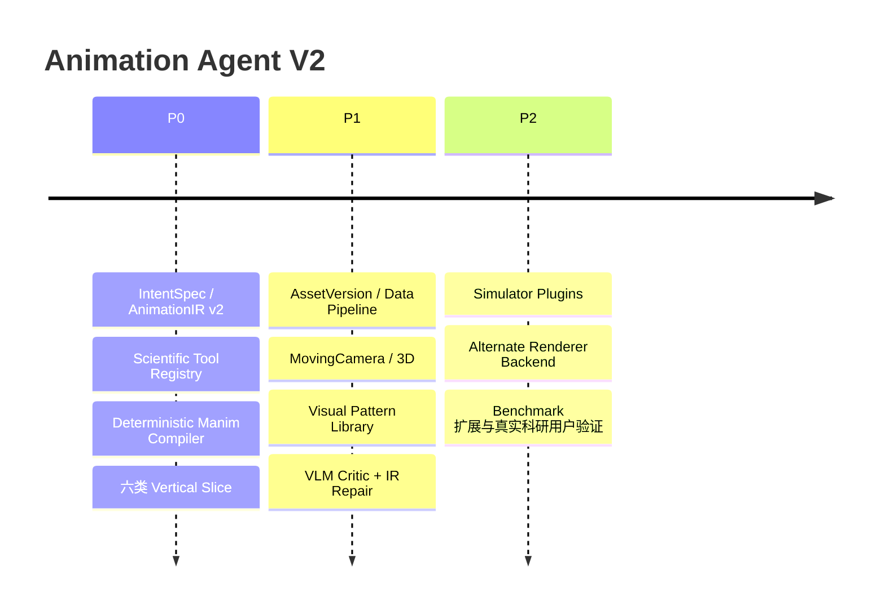

# Manim_project → Animation Agent 深度研究与升级计划

## 执行摘要

截至 **2026 年 8 月 19 日**，`Manim_project` 已经具备一个相当成熟的“AI 代码生成 → 安全校验 → 隔离渲染 → 质量诊断 → 自动修复 → 产物交付”工程骨架。仓库 README 明确把当前产品定位为面向数学教学的本地工作台，主链路是 `教学 Prompt → ContentPlan → CodeVersion → Preview/Final → QualityReport`；API、Runner、Web、Redis 队列、版本化、Sandbox 与质量模块已经分层。fileciteturn2file0L2-L2

真正限制产品上限的不是渲染基础设施，而是**LLM 与 Renderer 之间缺少一个领域无关、可验证、可编译的动画语义层**。当前 `builder.py` 要求模型选取一个最简单参考 Scene、保持其结构、仅修改文本/公式/范围/颜色，不允许发明新的 updater/API/class pattern，并主动把参考场景的 `MathTex` 降级为 `Text`；安全校验又要求恰好一个 `GeneratedScene(Scene)`。这些约束提高了首次成功率，却同时压制了 Camera、3D、复杂状态依赖、公式局部变形和跨领域科研可视化。fileciteturn10file0L2-L2 fileciteturn17file0L2-L2

因此建议把产品重新定义为：

> **Natural Language / Data / Equation → Animation Agent → Scientific Computation → AnimationIR → Renderer Compiler → Video → Semantic Critic**

目标不是“让 LLM 更自由地写 Manim Python”，而是让 LLM **规划和驱动系统**，让程序化 Compiler 负责大部分可靠代码生成。这个思路与 Vega/Vega-Lite 的声明式 JSON、Reactive Vega 的数据流图以及 Lottie 的版本化动画 Schema 有直接的设计类比：语义声明与执行后端解耦，可以获得验证、重定向和编译优化空间。citeturn9search8turn9search0turn15search1turn15search3

建议用 **P0/P1/P2，约 53–80 人日**完成核心升级；第一阶段不要追求“万能科研 Agent”，而应先证明六个纵向场景能稳定做到：

```text
一句话
  ↓
IntentSpec
  ↓
受控科学工具
  ↓
AnimationIR
  ↓
确定性 Manim Compiler
  ↓
现有 Sandbox
  ↓
视频
```

## 目标、成功标准与仓库诊断

最终 UX 仍应只有“一句话 + 可选资产”，但内部允许多次 LLM/Tool 调用。ReAct 的核心启示正是把语言模型的规划与对外部工具/环境的行动交替起来，而不是要求一次生成完成所有推理和执行。citeturn9academia41

建议设定以下量化验收基线：

| 指标 | P0 目标 | P1/P2 目标 |
|---|---:|---:|
| IntentSpec / IR Schema 合法率 | ≥98% | ≥99.5% |
| 黄金集科学/语义正确率 | ≥90% | ≥95% |
| 首次 Render 成功率 | ≥85% | ≥92% |
| 最终 Render 成功率 | ≥97% | ≥99% |
| Prompt→视频表达准确率 | ≥4.0/5 | ≥4.3/5 |
| 视觉连贯性 | ≥4.0/5 | ≥4.3/5 |
| 平均自动修复次数 | ≤1.2 | ≤0.8 |
| 未恢复生成失败率 | <3% | <1% |
| 同 IR→同时间线/代码 | 100% | 100% |
| ToolRun 参数、输入哈希、输出溯源 | 100% | 100% |
| 安全攻击黄金集 Sandbox escape | 0 | 0 |

当前仓库的**保留价值很高**。README 显示 `apps/api`、`apps/runner`、`apps/web`、`packages/contracts`、`reference_scenes`、`benchmarks/eval` 已形成清晰层次；Runner 中已有 `queue/`、`rendering/`、`sandbox/`、`quality/`，不应推倒重建。fileciteturn7file0L2-L2 fileciteturn18file0L2-L2

Phase 9 的仓库自验收记录还显示：30 个黄金任务执行 60 次 Preview/Final 终态渲染，时间线差为零；自动恢复最多两次并有重复诊断熔断；Sandbox 已采用无网络、非 root、只读根文件系统、cap-drop、CPU/PID/内存限制。仓库同时报告当时 `519 passed`。这些属于项目自身验收证据，但足以说明执行层值得继承。fileciteturn20file0L2-L2

建议：

| 当前模块 | 决策 | V2 方向 |
|---|---|---|
| `apps/web` | **保留** | UI 改为 Prompt + Asset + Agent Run/IR/Video |
| `auth/projects/jobs/delivery` | **保留** | 泛化命名即可 |
| `apps/runner/{queue,rendering,sandbox}` | **强保留** | 增 Compute Sandbox |
| `packages/contracts` | **扩展** | 增 `IntentSpec`、`AnimationIR`、`ToolRun` |
| `content_plans/` | **降级/兼容** | 教学场景变成 Intent 的一种 specialization |
| `code_generation/prompts/builder.py` | **核心重构** | LLM 不再主要输出 Python，而输出 Intent/IR |
| `template_compiler.py` | **演进** | 变成正式 `compiler/manim` |
| `security/validator.py` | **保留并重构** | 从仅 `Scene` 扩至受控 Scene capability |
| `reference_scenes/` | **重组** | 从“题型模板”变成“动画模式库” |
| `quality/` | **扩展** | 加 Scientific Assertions + VLM Semantic Critic |
| 科研 AssetVersion | **未指定** | 新增不可变资产与 provenance 层 |

## 关键技术研究与目标架构

**AnimationIR — P0。** 推荐采用“声明式 scene graph + reactive state + timeline”而不是 Python 字符串。Vega 用 JSON 描述 data/signals/marks，signal 的变化可传播并重新渲染；Reactive Vega 则把数据、scene graph 与交互建成数据流图；Lottie 也采用版本化 JSON Schema 表示 layers/assets。这三者都是 AnimationIR 很好的设计先例。citeturn9search8turn9search0turn15search10turn15search3

```json
{
  "schema_version":"2.0",
  "scene":{"dimension":"2d","renderer_hint":"manim"},
  "assets":[],
  "data":[{"id":"traj","kind":"array","artifact_ref":"tool:run1"}],
  "states":[{"id":"t","type":"scalar","initial":0,"range":[0,10]}],
  "objects":[{"id":"p","type":"point"},{"id":"curve","type":"path","data_ref":"traj"}],
  "bindings":[{"target":"p.position","source":{"op":"sample","data":"traj","state":"t"}}],
  "timeline":[{"op":"create","targets":["curve"]},{"op":"animate_state","target":"t","to":10,"duration":8}],
  "camera":[{"op":"follow","target":"p"}],
  "assertions":[{"type":"object_visible","target":"p"}],
  "fallbacks":[{"on":"camera_unsupported","strategy":"static_frame"}]
}
```

关键原则是：`binding/source` 使用**受限表达式 DSL 或函数注册表**，而不是自由 Python；IR 必须带 schema version、stable ID、输入来源、scientific assertions 和 fallback。

**IntentSpec / Agent — P0。** 内部链路建议为 `Intent Resolver → Scientific Planner → Tool Executor → Visual Director → IR Validator → Compiler → Render → Critic → Repair IR`。一句话 UX 不等于一次模型调用；只有科学含义存在高风险歧义时才进入 `needs_confirmation`，其余默认值写入 assumptions。自然语言先转结构化视觉 specification 也有 NL4DV、Data2Vis 等研究先例。citeturn9academia41turn16academia40turn16academia39

**Scientific Planner — P0。** SymPy 负责符号方程、微积分和方程求解；SciPy 的 `solve_ivp` 适合 ODE 初值问题；NumPy 负责数组/线代/采样；pandas 负责 CSV 表格。计算应发生在 Tool/Compute 层，Manim 只消费结果。citeturn13search2turn12search9turn13search0 外部 CFD/FEM/MD simulator 采用注册式 Adapter，P0 不做任意程序执行；OpenFOAM/FEniCS 等具体集成：**未指定，建议 P2**。

**Visual Director — P0/P1。** 把 reference corpus 从“二次公式/黎曼和”等题型改为动画语义模式：`formula_morph`、`parameter_sweep`、`moving_tangent`、`convergence`、`trajectory_trace`、`field_evolution`、`camera_focus`、`3d_orbit`、`data_anomaly`、`comparison`。Vega-Lite 的经验说明，高层语义 grammar 再由 compiler 补齐底层实现，比直接生成低层绘图逻辑更可组合。citeturn15search1turn15search12

**Compiler — P0。** 采用 `Core IR → capability lowering → RendererBackend`：

```text
AnimationIR
 ├─ ManimBackend → Scene / MovingCameraScene / ThreeDScene
 ├─ Future: Web Renderer
 └─ Future: Blender/其他 Backend
```

未知 capability 返回结构化 `UnsupportedFeature` 并应用 fallback，不让 LLM临场注入 Python。

**Manim lowering — P0/P1。** `ValueTracker` 本来就是追踪可动画实数参数的 Mobject；`always_redraw` 会逐帧重建依赖对象；`AnimationGroup/LaggedStart/Succession` 支持并行、错峰和顺序编排；`TransformMatchingTex` 保持相同 LaTeX 子结构；`MovingCameraScene` 支持移动 Camera frame；`ThreeDScene` 提供三维 Camera 与 ambient rotation。citeturn10search13turn10search0turn11search3turn11search1turn10search1turn11search0

**Data/Asset — P1。** 新增不可变 `AssetVersion`：`sha256/MIME/size/schema/columns/dtype/source/derived_from`。CSV 限列、限行并明确 dtype；`.npy/.npz` 对不可信数据必须 `allow_pickle=False`，NumPy 官方明确警告 pickle/object array 可造成任意代码执行风险。citeturn13search0turn12search0turn12search11 PDF 论文解析器、3D 模型格式和 executable model serialization：**未指定**；建议单独 ingestion sandbox。

**安全与质量 — P0/P1。** 现有 AST validator 应成为 defense-in-depth，而非唯一边界；新增独立 Compute Sandbox，默认禁网、白名单工具、资源配额、只读输入、独立输出。Docker 官方同样建议尽量采用非特权用户；Rootless 模式能让 daemon 与容器都不以 root 运行。citeturn8search0turn8search9 质量评价不能再只有“有没有坏”：VBench 把视频质量拆为运动平滑、时序闪烁、空间关系等 16 维；EvalCrafter 也采用视觉、内容、运动、文本对齐的多指标；TIFA 的“根据文本生成可回答的视觉问题再验证”可改造成 Prompt→Video semantic QA。citeturn14academia49turn14academia50turn14academia48

## 分阶段路线图



| 阶段 | 里程碑与交付物 | 验收 | 粗估人日 | 主要风险 |
|---|---|---|---:|---|
| **P0** | IntentSpec、IR v2、IR validator、SymPy/NumPy/SciPy/pandas 工具、Manim compiler、6 vertical slices | ≥85% 首次渲染；≥97% 最终成功；IR deterministic；科学正确率≥90% | 18–25 | IR 过度设计 |
| **P1** | AssetVersion、2D Camera/3D、模式库、VLM critic、IR-level repair、50–100 Prompt golden set | 表达≥4.2/5；平均修复≤1；资产全 provenance | 20–30 | VLM误判、渲染成本 |
| **P2** | Simulator Adapter、第二 Renderer、性能/缓存、100–300 Prompt benchmark、科研用户试用 | 科学正确率≥95%；最终失败<1%；跨 backend IR smoke-test | 15–25 | 长尾领域与成本 |

P0 最重要的里程碑不是 UI，而是证明 **“LLM 不写自由 Manim 代码，也能生成明显比当前模板体系复杂的动画”**。

## 代表性实验矩阵

**教学：**“展示傅里叶级数逐渐逼近方波，并放大 Gibbs 现象。”

```json
{"domain":"math.signal","goal":"show Fourier convergence and Gibbs overshoot","inputs":[],"assumptions":["period=2π"],"output":{"duration":20,"dimension":"2d"}}
```

```json
{"scene":{"dimension":"2d"},"objects":[{"id":"square","type":"graph"},{"id":"sum","type":"graph"}],"states":[{"id":"N","type":"integer","initial":1}],"bindings":[{"target":"sum.data","source":{"op":"fourier_sum","N":"$N"}}],"timeline":[{"op":"animate_state","target":"N","to":31,"duration":12}],"camera":[{"op":"zoom","target":"discontinuity"}]}
```

工具：SymPy/NumPy；Renderer：MovingCameraScene。指标：谐波系数正确、overshoot 可见、N 顺序正确。回退：静态 Camera + 离散 N=1/3/7/15/31。

**科研：**“展示三个初值只差 \(10^{-5}\) 的 Lorenz 系统轨迹逐渐分离。”

```json
{"domain":"dynamical_systems","goal":"visualize sensitive dependence","inputs":[],"assumptions":["σ=10,ρ=28,β=8/3"],"output":{"dimension":"3d","duration":25}}
```

```json
{"scene":{"dimension":"3d"},"data":[{"id":"traj3","source":"tool:solve_ivp"}],"objects":[{"id":"paths","type":"trajectory_set"}],"states":[{"id":"t","type":"scalar","initial":0}],"timeline":[{"op":"trace","target":"paths","state":"t","duration":18}],"camera":[{"op":"ambient_rotate","rate":0.08}],"assertions":[{"type":"trajectory_error","max":1e-5}]}
```

工具：SciPy `solve_ivp`；Renderer：ThreeDScene。指标：数值误差、三轨迹初始距离和后期分离均正确。回退：预计算轨迹 + 固定 3D Camera。citeturn12search9turn11search0

**工程：**“展示 PID 参数改变时二阶系统阶跃响应、超调和控制量如何变化。”

```json
{"domain":"control","goal":"compare PID responses","inputs":[],"assumptions":["normalized second-order plant"],"output":{"dimension":"2d","duration":24}}
```

```json
{"scene":{"dimension":"2d"},"data":[{"id":"responses","source":"tool:control_sim"}],"objects":[{"id":"y","type":"graph"},{"id":"u","type":"graph"},{"id":"metrics","type":"numeric_panel"}],"timeline":[{"op":"compare","target":"responses","duration":18}],"assertions":[{"type":"metric_match","fields":["overshoot","settling_time"]}]}
```

工具：SciPy/受控 control simulator；Renderer：Manim Scene。指标：响应曲线与计算指标一致。回退：只显示预计算三组参数，不做连续调参。

**数据可视化：**“从上传 CSV 展示 temperature/pressure 演化，并突出 350 秒附近异常。”

```json
{"domain":"data_analysis","goal":"show temporal anomaly","inputs":[{"id":"exp","type":"csv","required":true}],"assumptions":[],"output":{"dimension":"2d","duration":18}}
```

```json
{"scene":{"dimension":"2d"},"data":[{"id":"df","asset":"exp"}],"objects":[{"id":"temp","type":"timeseries"},{"id":"pressure","type":"timeseries"},{"id":"anomaly","type":"region"}],"timeline":[{"op":"reveal","targets":["temp","pressure"]},{"op":"highlight","target":"anomaly","duration":4}],"camera":[{"op":"zoom","range":[330,370]}]}
```

工具：pandas/NumPy；Renderer：MovingCameraScene。指标：数据点、单位、异常位置与原 CSV 一致。缺 Asset 时**不得伪造科研数据**，返回 `asset_required`。citeturn13search0

**三维：**“展示三维螺旋线上的切向量、法向量和副法向量随参数移动。”

```json
{"domain":"differential_geometry","goal":"animate Frenet frame","inputs":[],"assumptions":["r(t)=(cos t,sin t,0.2t)"],"output":{"dimension":"3d","duration":20}}
```

```json
{"scene":{"dimension":"3d"},"objects":[{"id":"curve","type":"parametric_curve"},{"id":"frame","type":"vector_frame"}],"states":[{"id":"t","type":"scalar","initial":0}],"bindings":[{"target":"frame","source":{"op":"frenet_frame","state":"t"}}],"timeline":[{"op":"animate_state","target":"t","to":12.56,"duration":14}],"camera":[{"op":"ambient_rotate"}]}
```

工具：SymPy/NumPy；Renderer：ThreeDScene。指标：T/N/B 正交性误差、单位长度、运动连续性。回退：降低采样密度/停止 Camera 旋转。

**混合科研：**“根据上传论文中的动力学方程和实验 CSV，模拟模型并与实验数据做动画对比。”

```json
{"domain":"scientific_reproduction","goal":"compare paper model with experiment","inputs":[{"id":"paper","type":"pdf"},{"id":"exp","type":"csv"}],"assumptions":[],"output":{"dimension":"2d","duration":30}}
```

```json
{"scene":{"dimension":"2d"},"data":[{"id":"obs","asset":"exp"},{"id":"sim","source":"tool:ode_solver"}],"objects":[{"id":"observed","type":"graph"},{"id":"predicted","type":"graph"},{"id":"error","type":"residual_panel"}],"timeline":[{"op":"compare","targets":["observed","predicted"],"duration":20}],"assertions":[{"type":"residual_matches_tool"}]}
```

工具：PDF ingestion（**具体解析器未指定**）+ pandas + SymPy + SciPy；Renderer：Manim。指标：方程/参数 provenance、模拟残差、曲线一致性。方程提取置信不足时回退到 `needs_confirmation`，绝不能自行补公式。

## Prototype 实施蓝图

核心 Compiler 可先保持非常小：

```python
def compile_animation(ir: AnimationIR) -> CodeArtifact:
    ir = validate_and_normalize(ir)
    backend = renderer_registry.require(ir.scene.renderer_hint)
    scene_base = backend.select_scene_base(ir)   # Scene / MovingCameraScene / ThreeDScene

    ctx = backend.begin(scene_base)

    for dataset in ir.data:
        ctx.register_data(resolve_artifact(dataset))

    for state in ir.states:
        ctx.emit_state(lower_state(state))

    for obj in ir.objects:
        ctx.emit_object(lower_object(obj, ctx))

    for binding in ir.bindings:
        ctx.emit_binding(lower_binding(binding, ctx))

    ctx.emit_timeline(lower_timeline(ir.timeline, ctx))
    ctx.emit_camera(lower_camera(ir.camera, ctx))

    source = ctx.finish()
    validate_generated_source(source)            # defense-in-depth
    return CodeArtifact(source=source, ir_hash=ir.sha256())
```

关键 lowering 规则：

| IR | Manim |
|---|---|
| scalar continuous state | `ValueTracker` |
| geometry binding | `always_redraw` / updater |
| parallel timeline | `AnimationGroup` |
| staggered | `LaggedStart` |
| strict sequence | `Succession` 或连续 `play` |
| math object | `MathTex` |
| math morph | `TransformMatchingTex` |
| `camera.pan/zoom/follow` | `MovingCameraScene` |
| dimension=`3d` | `ThreeDScene` |
| precomputed scientific data | 只读 NumPy array → Mobject |

这些映射直接对应 Manim 官方现有能力；特别是 `always_redraw` 的语义就是每帧重建，因此大型 Mesh/复杂文本不宜默认使用，应优先预计算或细粒度 updater，这是从其执行机制推出的性能建议。citeturn10search0turn11search3turn11search1turn10search1turn11search0

建议新增：

```text
packages/contracts/.../intent.py
packages/contracts/.../animation_ir.py

apps/api/.../agent/orchestrator.py
apps/api/.../agent/intent_resolver.py
apps/api/.../agent/scientific_planner.py
apps/api/.../agent/visual_director.py

apps/api/.../tools/{sympy,numpy,scipy,pandas}.py
apps/api/.../animation_ir/{service,validation}.py
apps/api/.../compiler/{base,manim,registry}.py
apps/api/.../quality/{semantic,scientific}.py

apps/runner/.../sandbox/compute_runtime.py
reference_patterns/
```

重点修改 `code_generation/prompts/builder.py`、`template_compiler.py`、`security/validator.py`、`content_plans/*` 和 `packages/contracts/*`；这些目录当前均实际存在。fileciteturn8file0L2-L2 fileciteturn19file0L2-L2

建议的新 API 为 `POST /agent-runs`、`GET /agent-runs/{id}`、`GET /agent-runs/{id}/events`、`POST /assets`、`GET /intent-versions/{id}`、`GET /animation-ir-versions/{id}`、`POST /agent-runs/{id}/repair`。现有具体业务 URL 与这些名称是否冲突本次未逐一路由核对，故**最终路径未指定**；应沿用仓库现有 owner isolation、append-only/versioning 风格。

## 评估、优先资料与风险控制

评估必须形成三层证据链：

```text
结构/数值测试
     +
实际 Render CV 指标
     +
VLM 语义问答
     +
少量人工专家评分
```

其中科学结论不能只交给 VLM。方程、轨迹、残差、正交性、积分值等应由 Scientific Tool 重新计算并用 IR `assertions` 比较；VLM 只判断“视频是否把它表达出来”。VBench/EvalCrafter 说明视频评价宜拆为多维指标而非单一总分，TIFA 则提供了可解释 QA 式语义忠实度思路。citeturn14academia49turn14academia50turn14academia48

| 度量 | 方法 |
|---|---|
| 科学正确率 | Tool ground truth / 专家抽检 |
| 表达准确率 | Prompt→自动 QA + 人工 1–5 |
| 视觉连贯性 | temporal smoothness、对象 identity、Camera continuity |
| Render 稳定率 | successful renders / total |
| 首次生成失败率 | first-pass failure / total |
| 平均修复次数 | repairs / successful runs |
| IR 编译稳定性 | 同 IR hash 重复编译一致 |
| 数据忠实度 | 图中值与 Asset/Tool output 数值比较 |
| 安全性 | malicious IR/assets/tool-call corpus |
| 成本 | LLM tokens + compute + render seconds / 成功视频 |

优先阅读顺序建议是：**Manim 0.20.1 官方** `ValueTracker/always_redraw`、Camera/3D、Animation composition、TransformMatchingTex；citeturn10search0turn10search13turn10search1turn11search0turn11search3 **IR/scene graph** 阅读 Vega Specification、Reactive Vega、Vega-Lite、Animated Vega-Lite、Lottie JSON Schema；citeturn9search8turn15search10turn15search1turn15search5turn15search3 **Agent** 阅读 ReAct；citeturn9academia41 **科学工具**以 SymPy、SciPy、NumPy、pandas 官方文档为准；citeturn16search1turn12search9turn12search11turn13search0 **评价**优先 VBench、EvalCrafter、TIFA。citeturn14academia49turn14academia50turn14academia48 同等级、覆盖上述核心 API 的中文原始官方资料：**未指定**，因此不建议为了“中文优先”牺牲一手资料可信度。

最大的技术风险是 IR 变成“另一种 Python”；缓解办法是坚持 typed DSL、capability registry 和六个 vertical slice 驱动 schema 演化。数据风险是论文/CSV/NPY/模型资产不可信，应做大小、MIME、dtype、hash、parser sandbox 和 provenance，尤其禁止不可信 NumPy pickle。citeturn12search0 安全风险是科研工具把攻击面从 Manim 扩展到计算环境，应把 Compute Sandbox 与 Render Sandbox 分离并保持无网、非特权、配额执行。citeturn8search0turn8search9 成本风险通过 Tool/Simulation 缓存、IR hash、低清 Preview、只在语义失败时调用 VLM 修复降低；UX 风险则通过“默认自动推断 + assumptions 可审阅 + 仅关键科学歧义才暂停”解决。

**最终研究结论是：V2 不应继续把主要研发资源投入“更强的 Manim code-generation prompt”。核心资产应转移到 `IntentSpec + Scientific Tool Registry + AnimationIR + Visual Pattern Library + deterministic compiler + semantic/scientific evaluator`。** 现有 Runner、Sandbox、版本链、质量历史和交付层恰好为这一升级提供了很好的执行底座；真正需要重做的是中间的“动画大脑”，而不是整个项目。